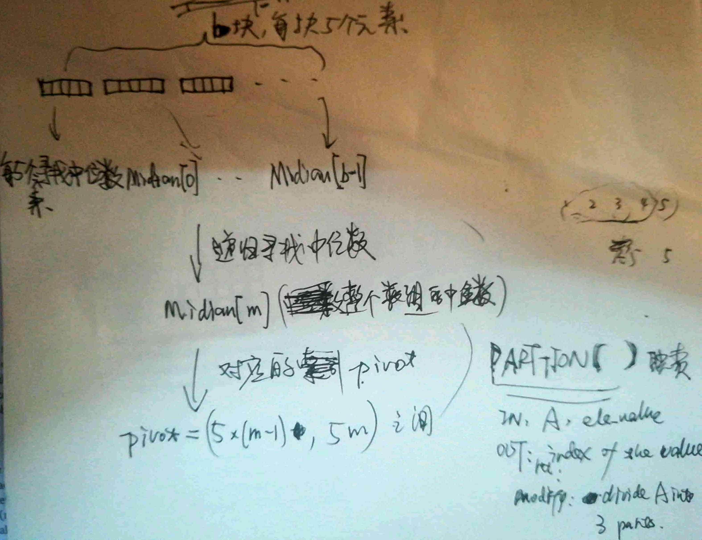

# Math
some joy......

[TOC]

[1.古典概率题](#一个古典概率问题)

[2.寻找中位数](#无序数列中寻找中位数)(*find the median of an array*)

[3.N queens](#N queens)

[4.'[<>]'(a Chinese board game )](#'[<>]')


---

##  一个古典概率问题

[Q & A](./19.8.1.0.md)

## 无序数列中寻找中位数

*Fine the median of an unsored array in linear time.*


## N queens
1. [**"Back Tracking"** solution](./source/PlaceQueens.py)
2. [**"Dynamic Programming"** solution](./source/PlaceQueen2.py)

* The "Dynamic Programming" have two points personally.
  * Find the **recursive** relation.
  * Analyse recursive space structure.
  * Order from bottom up, form right to left, form easy to hard.


## '[<>]'

A Chinese board game with its board looking like the shape`'[<>]'`.

The core is `Backtracking`.


---

## Algorithm

[1.Mergesort](#Mergesort)

[2.Quicksort](#Quicksort)

[3.Qucikselect](#Quicksort)

* [Momselect](#Momselect)

[4.LongestPath](#LongestPath)


---

### Mergesort

The core is `merge`,[source here](./source/Mergesort.py)

This Algorithm alse adapt to list and tree.

### Quicksort

The core is `diveide one to three`,[source here](./source/Quicksort.py)

This Algorithm also adapt to list, but not tree(I can not Parttion the tree now.)


### Quickselect
The core is `Parttion(the pivot is Xth smallest element)`,[source here](./source/Quickselect1.py)

==@bugs==: There is a bug where the pivot is not the Xth smallest element if there are the same ele in array.

==@example==: [-4,-4,-4,0,1,2,3,4], Quickselect(Array,4-1)=0(not 2) 

[Fixed version](./source/Quickselect2.py)

> Actually,  In "Fixed version", there are also bugs... If your iniput is [0,0,0,0] and find 3th smallest ele, this algorithm return 0(actually, it should return nothing)

==@Analysis==:

```python
def Quickselect(A,ordinal):
    assert (ordinal<=len(A))
    if(len(A)==1):
        return A[0]
    else:
        pivot = ordinal
        loca = Parttion(A,pivot)
        next_search_dir = Searchdir(A,loca,ordinal)
        if(0==next_search_dir):
            return A[loca]
        elif(1==next_search_dir):
            return Quickselect(A[loca+1:],ordinal-Getordinal(A,loca))
        else:
            return Quickselect(A[:loca],ordinal)
```

**T(N) = O(N) + MAX{ T(loca) , T(N - loca) }**

If we make `loca` = `N - loca`(->`loca = N/2`), the T(N) will decrease quickly.

So how can we make the `loca` because `N/2`,  and the key is that make the element `pivot` points to be the midian of A.

So let's get the midian's index `pivot`as far as possible.



### Momselect

developed `Quickselect`,[source here](./source/Momselect.py)


### LongestPath

Find the longest path in a graph.

```
LongestPath(v, t) :
if v = t
	return 0
if v.LLP is undefined 
	v.LLP <- minus INF
	for each edge v->w
		v.LLP <- max{ v.LLP, l(v->w) + LongestPath(w, t) }
	return v.LLP
```

I want to use dynamic programming to improve it, like this:

```
LongestPath(s, t) :
for each edge v->t
	v.LLP = l(v->t)
	NEXT[ ].add(v)
for each node n in NEXT[ ]
	NEXT.pop(n)
	for each edge v->n
		v.LLP = l(v->n)
		NEXT[ ].add(v)
return s.LLP
```

Let me see, do you feel that's like a ... WFS algorithm? Yes, when I write them down, I see...

The truly Dynamic Programming  shows below :

```
LongestPath(s, t) :
for each node v in postorder
	if v = t
		v.LLP <- 0
	else
		v.LLP <- minus INF
		for each edge v->w
			v.LLP <- max{ v.LLP, l(v->w)+ w.LLP }
return s.LLP
```

